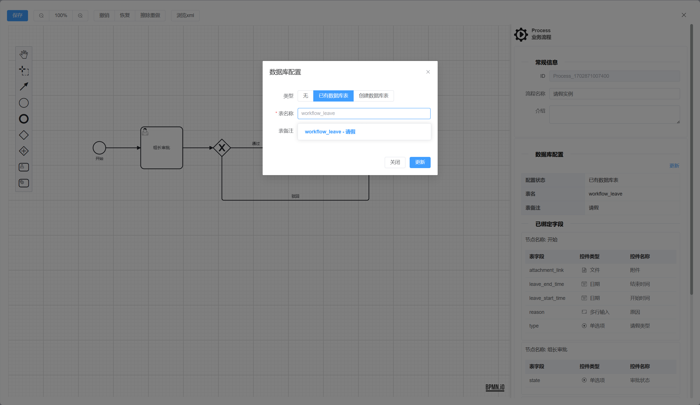
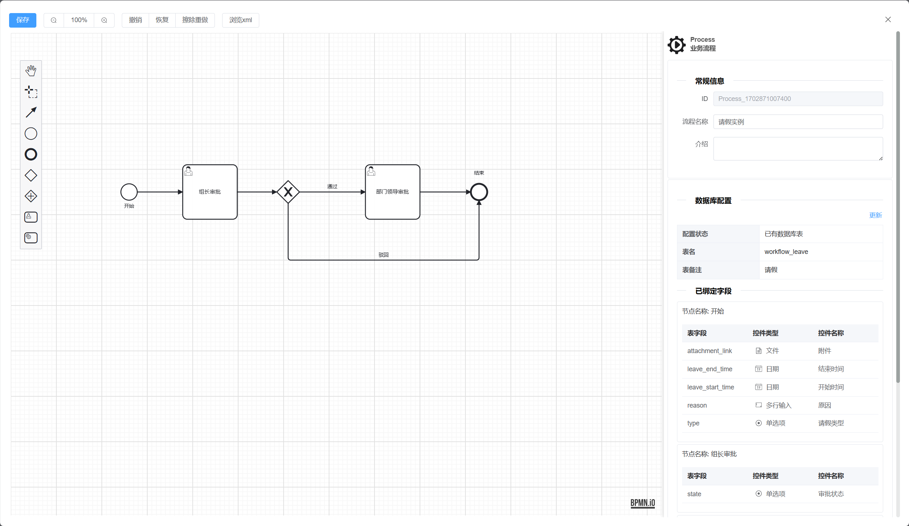
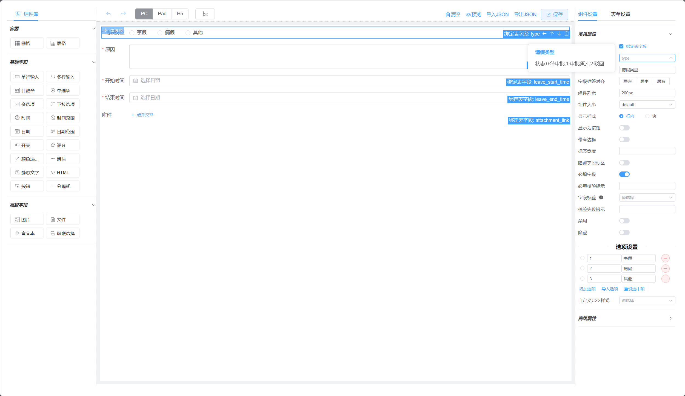
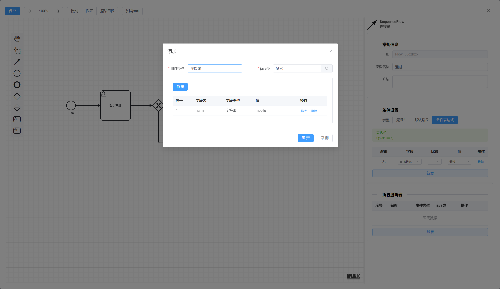
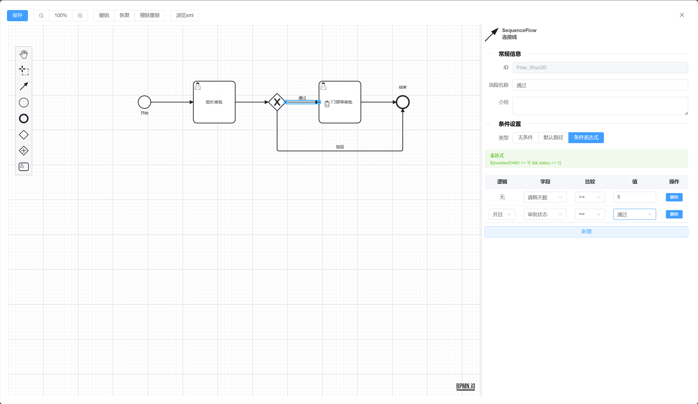
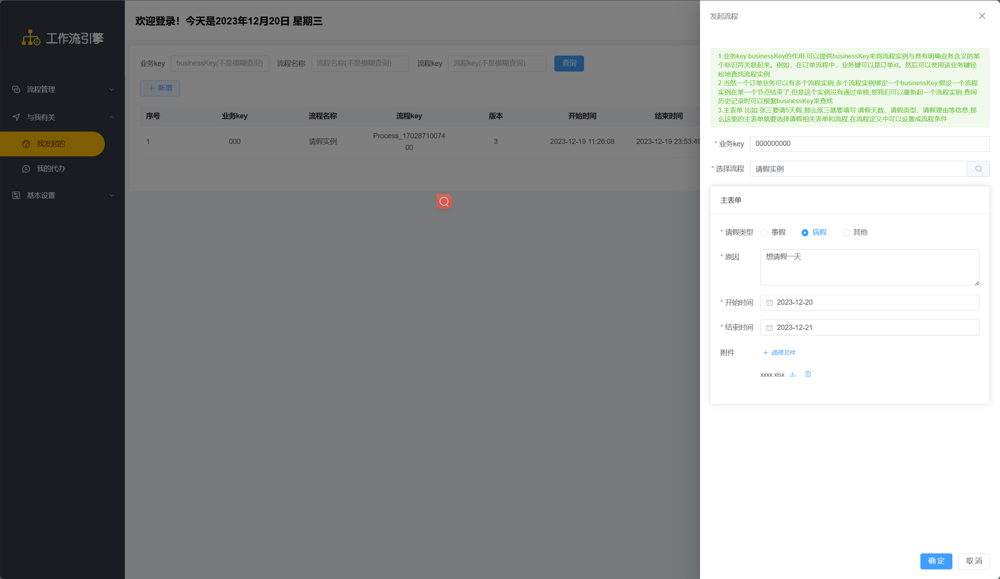
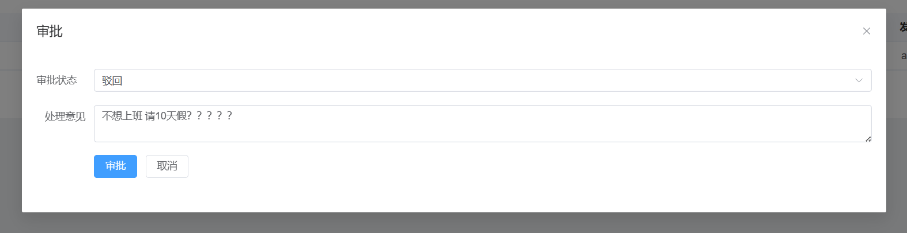
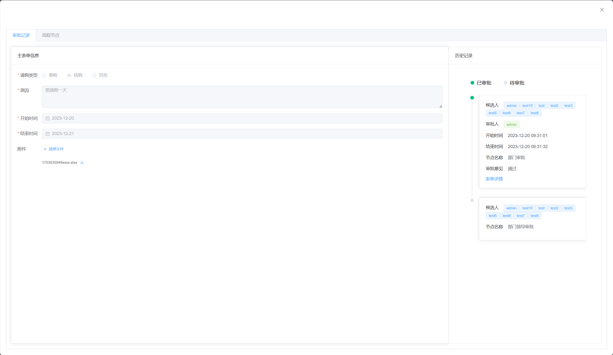
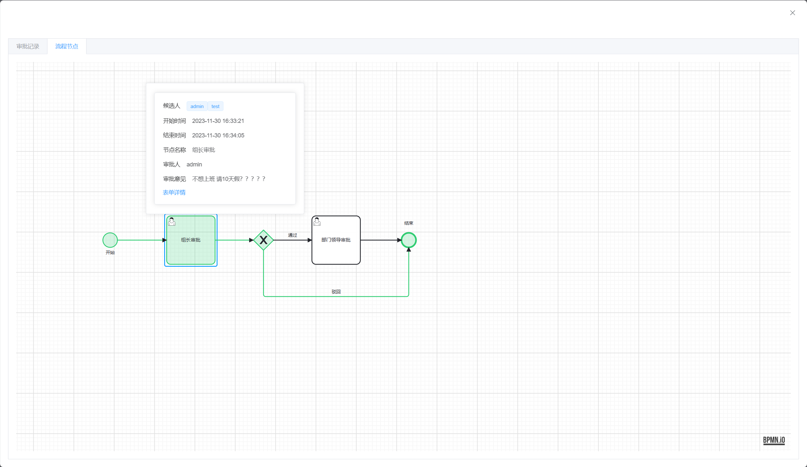

# 工作流

#### 介绍

兴趣使然，想开发一套自己认为的工作流

项目使用 `vue3` + `elementui-plus`+ `ts` + `Activit7` + `SpringBoot` ，项目从零搭建 可移植性高，无依赖多余框架

#### Git 仓库地址 (欢迎 Star⭐)

- Gitee：https://gitee.com/liu_guo_feng/spring-boot-activiti7
- Github：https://github.com/liuguofeng-java/spring-boot-activiti7

#### 在线体验地址

[工作流体验地址(宽度小请耐心等待)](http://119.3.177.255/)

账户:admin

密码:123

#### 相关文档

[本地部署文档](./document/deploy.md)

[关于流程定义表单和数据库表结构动态绑定(重要)](./document/bpmnDataTable.md)

#### 已完成功能

- [x] 假登录

- [x] 用户管理

- [x] 部门管理

- [x] 流程定义

- [x] 流程表单

- [x] 流程启动

- [x] 任务列表

- [x] 历史列表

- [x] 流程图历史节点高亮

- [x] 集成动态表单
  - [x] 主表单集成与展示
  - [x] 节点表单整合bpmn与展示
  
- [x] 集成bpmn.js (带优化)
  - [x] 用户节点 选择用户
  - [x] 整合流程变量
  - [x] 整合执行监听器
  
- [x] 表单绑定数据库表
  
- [ ] 提交、驳回、撤销、等按钮

- [ ] 会签、或签

####  预览

|  |          |
| -------------------------------- | --------------------------------- |
|              |  |
|          |          |
|             |            |
|               |               |

