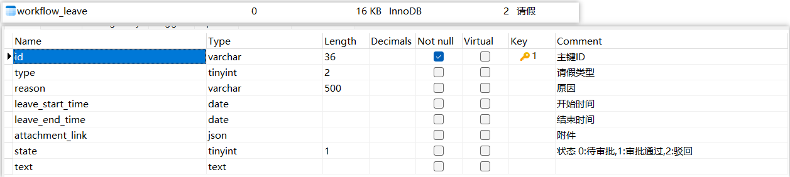
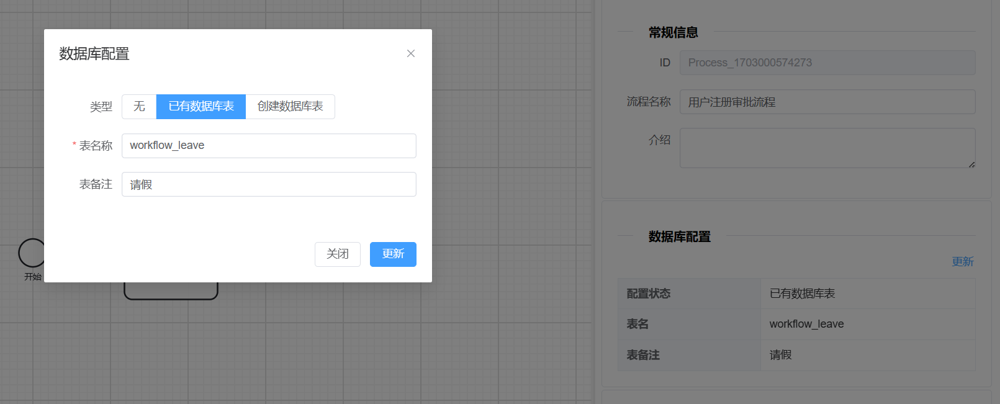
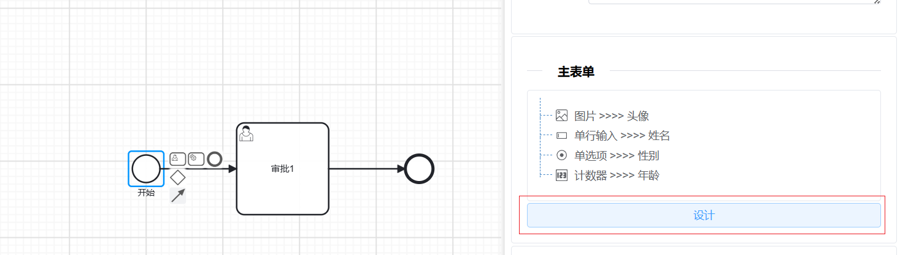
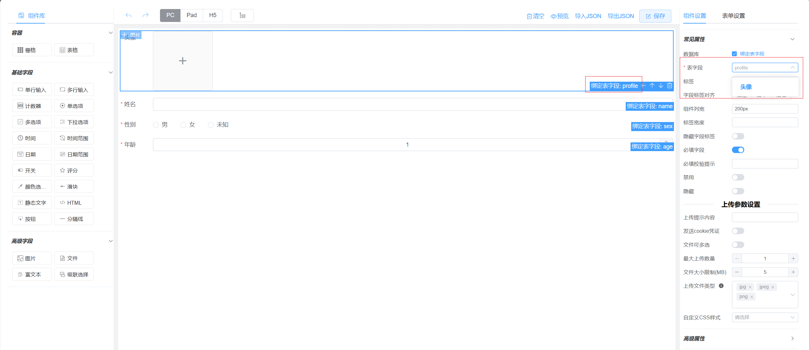
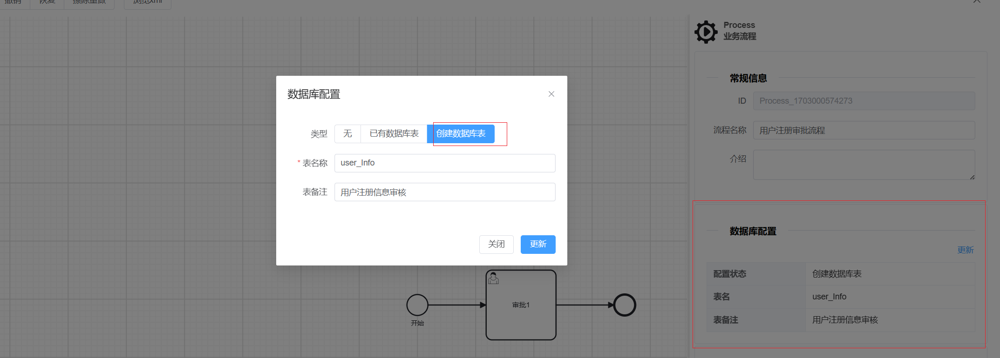
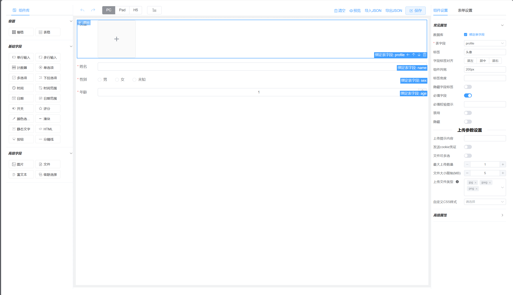
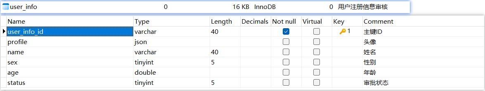

# 介绍

> 工作流项目不会依赖任何业务，都是通过表单和数据库表结构动态绑定的

#### 一.绑定已有的表

##### 1.表结构

> 要求:字段必须有主键，并且类型是varchar(40)

##### 2.在流程管理 >> 流程定义 >> 新建

##### 3.绑定成功后，在任意一个节点表单(甚至主表单)点击设计，可以和动态表单的字段进行绑定，一个节点表单被绑定后，另一个节点表单也可以再次绑定，`注意`:(后面表单的值会覆盖前面表单的值从而影响数据库中的绑定值)

​		

#### 二.绑定创建数据库表

##### 1.在流程管理 >> 流程定义 >> 新建 

##### 2.和绑定已有的表地第3步一致,唯一不同的是表字段从选择变成输入，输入的值将作为表字段，标签将作为字段备注

##### 3.设计完成后，保存流程系统将会自动创建表结构

#### 三.关于表单字段和数据库对应关系扩展

> `getWidgetDataType` 是组件和数据库类型对应关系，如: 绑定已有的表后，输入框可以选择数据库中的类型配置
>
> `getDefaultWidgetDataType` 是默认组件对应数据库的类型，如: 绑定创建数据库表后，输入框绑定字段后生成的数据库类型以字段长度

